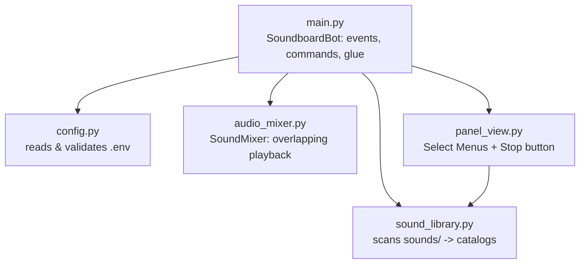

# Architecture

This documents how the bot is actually built and why, for whoever touches
the code next. For setup/deployment instructions, see [README.md](README.md).

## Overview

One bot process = one Discord bot token = one guild = one text channel = one
`sounds/` folder. There is no multi-tenancy: to serve multiple Discord
servers, you run multiple independent instances (see
[README's run options](README.md#4-run-the-bot)), each with its own `.env`
and `sounds/`. This was a deliberate choice, not a limitation we ran out of
time to fix — see [Single-tenant by design](#single-tenant-by-design) below.

## Module map

- **`config.py`** — the only module that reads environment variables. Every
  setting is validated eagerly at import time (fail fast with a clear
  message if `.env` is wrong, instead of failing deep inside some handler
  hours later). Nothing else in the codebase calls `os.getenv` directly.
- **`sound_library.py`** — pure filesystem/data logic, no Discord API calls.
  Exposes two catalogs from the same `sounds/` tree: `scan_sounds()` (capped
  to fit the panel's Select Menus) and `scan_all_clips()` (the full,
  uncapped list used by `/sound`'s autocomplete). No side effects beyond
  reading the filesystem and logging.
- **`audio_mixer.py`** — `SoundMixer`, a `discord.AudioSource` that mixes
  several `FFmpegPCMAudio` sources' PCM frames together so sounds overlap
  instead of cutting each other off.
- **`panel_view.py`** — the Discord UI components (`discord.ui.Select`/
  `Button`/`View` subclasses). Pure construction logic; the actual command
  handling lives in `main.py` and is reached through `self.view.bot`.
- **`main.py`** — the only module that touches `discord.Interaction`,
  `VoiceClient`, etc. Everything here is Discord-specific glue: it doesn't
  contain business logic that would be worth unit testing in isolation
  (that logic already lives in the other four modules, which are tested).

## Key design decisions

### The panel's category/message math

Discord hard-limits a message to 5 component rows, and a `Select Menu` to 25
options. Neither is configurable — they're the two genuine ceilings in this
project. Everything else about the panel is a workaround built on top of
them:

- A `Select Menu` takes a whole row, so **at most 5 categories fit in one
  message** — 4 if that message also needs to fit the 🛑 Stop Audio button
  in its own row.
- `PANEL_MAX_MESSAGES` (`.env`) lets the panel spread across several
  messages instead of being capped at one. Only the **last** message
  reserves a row for the button; earlier ones use all 5 rows for
  categories. `sound_library._max_categories_for()` computes the resulting
  total cap (`5 × (PANEL_MAX_MESSAGES − 1) + 4`), and
  `sound_library.chunk_for_messages()` does the actual splitting.
- `/sound`'s autocomplete isn't bound by either limit — it just returns up
  to 25 *matching* suggestions as you type, searching `scan_all_clips()`
  (the uncapped catalog). This is why it exists alongside the panel rather
  than instead of it: the panel is for point-and-click browsing within
  Discord's UI constraints, `/sound` is the escape hatch past them.

### `SoundClip.id` is a hash, not the file path

A `SelectOption`/autocomplete `Choice`'s `value` is capped at 100
characters by Discord. A real file path (`sounds/otros/Nassheed 1 Y2Mate is
Sawarim Djihad DmHx1LoD90k...mp3`) can exceed that — this shipped as a real
bug once and broke the entire panel with an opaque `400 Bad Request`.
`_make_clip()` now hashes the path (`sha1(path)[:16]`) and uses that as the
id everywhere a Discord value is needed; `SoundboardBot.clip_by_id` maps it
back to the real path when a sound is actually played. Both `scan_sounds()`
and `scan_all_clips()` hash the same way, so the same file always gets the
same id regardless of which catalog produced it.

### Persistent views and their `custom_id`s

The panel's buttons/menus need to keep working after a bot restart, even on
older messages still sitting in the channel — that's what
`discord.ui.View(timeout=None)` + `bot.add_view(...)` in `setup_hook` gives
you. The catch: persistent `custom_id`s must be unique per component across
the whole bot, not just within one message. `CategorySelect`'s id
(`panel_select_<category>`) is naturally unique since category names don't
repeat. The Stop Audio button initially got one `custom_id` per message
(`btn_stop_<index>`) back when every message had its own button; once the
design changed so only the *last* message carries a button, that indexing
became unnecessary and it's back to a single fixed `"btn_stop"`.

### `SoundMixer`: overlap via a never-ending `AudioSource`

Discord's voice API expects one `AudioSource` per `voice_client.play()`
call, and normally play() stops once the source signals end-of-stream.
`SoundMixer.read()` *never* returns empty — it returns silence when nothing
is queued — so it's played exactly once per voice connection, for as long
as the bot is in the channel. Playing a new sound is just
`mixer.add_source(filepath)`: another `FFmpegPCMAudio` gets added to
`_sources` and its PCM frames get summed (`audioop.add`) into the mix on
every 20&nbsp;ms tick, which is what makes sounds overlap instead of
interrupting each other.

### Single-tenant by design

Making the bot serve multiple Discord servers from one process would mean
`PANEL_CHANNEL_ID` and `sounds/` becoming per-guild instead of global
`.env` settings — realistically a small database (guild_id → config) and
per-guild sound storage. That's a real feature, not a config change, and
wasn't worth building before having a reason to (see the "one bot per
client" discussion in the project history). The current design optimizes
for the opposite: cheap, fully-isolated replication. Spinning up a new
instance is copying `.env`/`sounds/` and starting a new container/service —
no code changes, and a bug in one instance can't affect another.

## Deployment artifacts

Two things get built from this repo, by two independent CI jobs in
[`build.yml`](.github/workflows/build.yml):

| Artifact | Job | Trigger | Notes |
|---|---|---|---|
| `soundboard-linux` (PyInstaller executable) | `build-executable` | version tag push, or manual dispatch | Doesn't bundle `ffmpeg`/`libopus` — see below. |
| `ghcr.io/m4rdom/discord-soundboard-bot` (Docker image) | `publish-image` | every push to `main`, plus version tags | Built from `.container/Dockerfile`, unrelated to the executable — doesn't reuse it. |

They don't depend on each other, and neither depends on the third workflow,
[`test.yml`](.github/workflows/test.yml) (`ruff` + `pyright` + `pytest`,
every push to `main` and every PR) — nothing currently *blocks* a release
if tests are failing. Enforcing that requires a GitHub branch protection
rule (Settings → Branches), which isn't something a workflow file can do on
its own.

### Why the executable doesn't bundle `ffmpeg`

It used to, via PyInstaller's `--add-binary`. That shipped, got deployed to
a real Proxmox LXC, and failed at runtime with
`error while loading shared libraries: libdrm.so.2` — Ubuntu's `ffmpeg`
package links against roughly 100 shared libraries (video/audio backends
it never even uses for Discord voice), and copying just the `ffmpeg`
binary doesn't copy those. It worked on the exact GitHub Actions runner it
was built on and nowhere else. `apt install ffmpeg` on the *target* machine
resolves that dependency chain correctly for that machine, which bundling
a single extracted binary can't guarantee — so that's what Option D in the
README now asks for instead. Docker was never affected: it installs
`ffmpeg` via `apt-get` inside the image itself, at the same time as
everything else, so there's no cross-machine mismatch possible.

## Security model

- **Secrets never enter git or the Docker image.** `.env` is gitignored and
  `.dockerignore`d; the Dockerfile only ever `COPY`s `requirements.txt` and
  `src/`. Verified against the full git history, not just the current
  tree.
- **Secrets reach the running process only as environment variables**,
  injected at container/process start (`env_file:` in Compose,
  `EnvironmentFile=` in the systemd unit) — never written to disk inside
  the container/LXC.
- **The Docker image runs as a non-root user** (fixed UID `1000`), not
  root, for both the container process and (by extension) anything an
  exploited dependency might try to do.
- **Subprocess calls use argument lists, not shells.** `FFmpegPCMAudio` and
  friends invoke `ffmpeg` via `subprocess` with an argument list, not
  `shell=True` — filenames with unusual characters can't be used for
  command injection.
- **No secret is ever logged.** `config.DISCORD_TOKEN` is only ever passed
  to `bot.run(...)`; nothing formats it into a log line.
