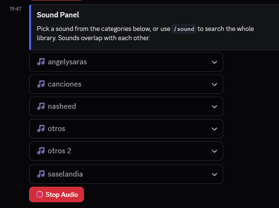
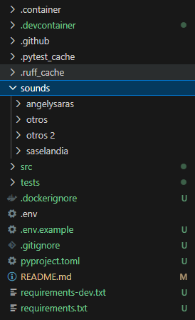
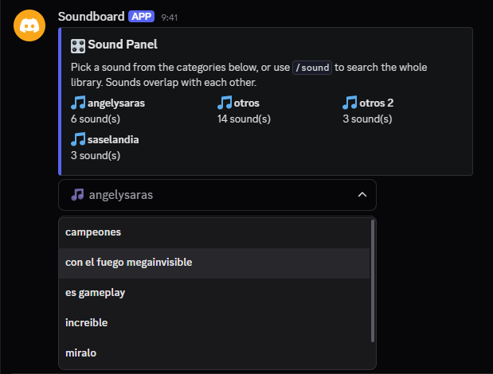
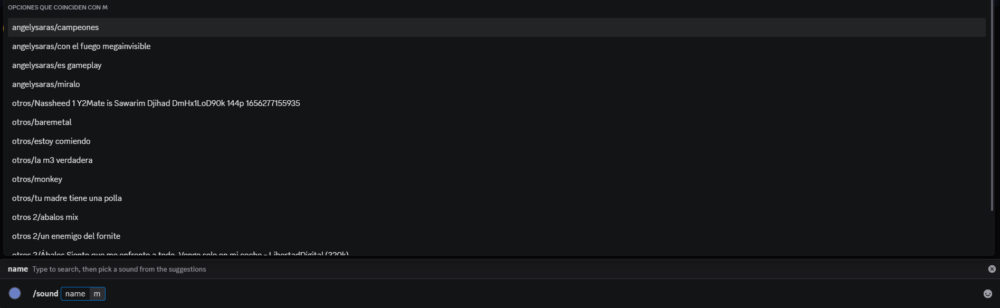

# Discord Soundboard Bot

Soundboard panel bot for a private Discord server. It scans a local `sounds/` folder and exposes a panel with dropdown menus (one per category) to play sound effects in the user's voice channel, with overlapping audio and a button to stop everything.



## Features

- Automatic scan of `sounds/<category>/` on startup (`.mp3` and `.ogg` formats).
- `/panel` command that posts the panel (also posted automatically on bot startup).
- One native Discord `Select Menu` per category, spread across as many messages as needed (see [Limitations](#limitation-25-sounds-per-category) for the per-category sound cap).
- `/sound <name>` command with autocomplete to search and play **any** sound in the library, without that cap.
- Red **🛑 Stop Audio** button.
- The bot automatically joins or moves to the voice channel of the user interacting with it.
- Sounds **overlap** with each other (playing a new one doesn't cut off the previous one).
- After every action (play or stop), the panel is reposted at the bottom of the channel so it stays visible.
- The bot only responds inside the text channel configured in `.env`.

## Limitation: 25 sounds per category

> ⚠️ This isn't a bug or a choice we made — it's a hard limit of Discord's UI. A `Select Menu` supports at most **25 options**, so a single category can show at most 25 sounds in the panel — that part isn't configurable, it's a Discord ceiling.

The number of *categories*, on the other hand, isn't really a limitation — it's just a `.env` setting. A message supports at most **5 component rows**, and each category's `Select Menu` takes up a whole row, so the panel spreads across as many messages as it needs: set **`PANEL_MAX_MESSAGES`** in `.env` (defaults to **3**). Only the **last** panel message reserves a row for the **🛑 Stop Audio** button (so it caps at **4 categories**); every earlier message uses all **5** rows for category menus instead, since it doesn't need one. That works out to `5 × (PANEL_MAX_MESSAGES − 1) + 4` categories total — **14** with the default of 3 — and there's no ceiling on `PANEL_MAX_MESSAGES` itself, so raising it raises the category count with it. After every action the bot deletes and reposts the *whole* set of panel messages together, so they always stay as one contiguous block at the bottom of the channel instead of drifting apart as the conversation continues.

If a category has more than 25 sounds, or your library has more categories than the current `PANEL_MAX_MESSAGES` allows, the excess is silently skipped from the panel (a warning is logged on startup naming what got left out) — but nothing is actually lost or deleted. **The `/sound <name>` command searches the entire library**, with no per-category or per-message limit, because Discord's autocomplete isn't bound by the same Select Menu constraints — it just returns up to 25 matching suggestions as you type. In practice: use the panel for quick access, raise `PANEL_MAX_MESSAGES` if you outgrow it, and `/sound` to reach anything past a category's 25-sound cap.

## Project structure

```
.
├── .devcontainer/
│   ├── Dockerfile          # VS Code / Codespaces dev environment (Python + ffmpeg)
│   └── devcontainer.json
├── .container/
│   ├── Dockerfile          # Standalone runtime image (docker build / docker compose)
│   └── docker-compose.yml   # Runs .container/Dockerfile with sounds/ bind-mounted
├── .github/
│   └── workflows/
│       └── build.yml       # Builds the Linux executable and the ghcr.io image (see below)
├── sounds/                # Sound categories (one subfolder = one category = one menu)
│   ├── memes/*.mp3
│   ├── games/*.mp3
│   └── reactions/*.mp3
├── src/
│   ├── main.py            # Bot entry point: events, /panel and /sound commands, voice logic
│   ├── config.py           # Loads and validates .env
│   ├── sound_library.py    # Scans sounds/ -> clip catalog (capped for the panel, and a flat/full one for /sound)
│   ├── audio_mixer.py      # AudioSource that mixes several .mp3/.ogg files in parallel (overlap)
│   └── panel_view.py        # Select Menus + "Stop Audio" button
├── tests/                # pytest suite (src/sound_library.py)
├── .dockerignore           # Applies to .container/Dockerfile's build context (repo root)
├── pyproject.toml          # pytest / ruff / pyright configuration
├── requirements.txt        # Runtime deps only (used by .container/Dockerfile)
├── requirements-dev.txt    # requirements.txt + pytest/ruff/pyright/pyinstaller, for local dev and packaging
├── CHANGELOG.md            # Notable changes per version (Keep a Changelog format)
└── .env.example
```

## 1. Create the Discord application

1. Go to the [Discord Developer Portal](https://discord.com/developers/applications) and create a **New Application**.
2. On the **Bot** tab, click **Reset Token** and copy the token (you'll need it for `DISCORD_TOKEN`).
3. Under **Privileged Gateway Intents**, this bot **doesn't need any privileged intent enabled**:
   - ❌ Presence Intent — not used.
   - ❌ Server Members Intent — not used.
   - ❌ Message Content Intent — not used (everything runs on Slash Commands and component interactions, not text messages).
   - Access to users' voice state (`member.voice`) uses the **`voice_states`** intent, which is **not privileged** and is already included in `discord.Intents.default()`. No toggle needed in the portal.
4. Under **OAuth2 → URL Generator**, check the scopes:
   - `bot`
   - `applications.commands`

   And under **Bot Permissions**, at minimum:
   - `View Channels`, `Send Messages`, `Manage Messages` (needed to delete the previous panel when reposting), `Embed Links`
   - `Connect`, `Speak` (voice)
5. Open the generated URL and invite the bot to your server.

## 2. Configure the project

```bash
cp .env.example .env
```

Edit `.env`:

```env
DISCORD_TOKEN=your_token_here
PANEL_CHANNEL_ID=123456789012345678   # text channel where the panel will live
GUILD_ID=123456789012345678           # optional, syncs /panel instantly during development
SOUNDS_DIR=sounds                     # optional
PANEL_MAX_MESSAGES=3                  # optional, see Limitations below
LOG_LEVEL=INFO                        # optional, one of DEBUG/INFO/WARNING/ERROR/CRITICAL
```

To get the IDs, enable **Developer Mode** in Discord (Settings → Advanced) and right-click the channel/server → **Copy ID**.

## 3. Add sounds

Place your `.mp3` or `.ogg` files inside subfolders of `sounds/` (no need to convert anything: `ffmpeg` decodes both formats equally well). Each subfolder becomes a category (a dropdown menu):

```
sounds/
├── memes/
│   ├── bruh.mp3
│   └── vine-boom.ogg
├── games/
│   └── minecraft-hurt.mp3
└── reactions/
    └── applause.ogg
```

> ⚠️ More than 25 sounds in one category, or more categories than `PANEL_MAX_MESSAGES` allows? See [Limitation: 25 sounds per category](#limitation-25-sounds-per-category) — nothing is lost, `/sound` still reaches everything.
>
> ⚠️ If the same category has both `bruh.mp3` and `bruh.ogg`, they'll show up as two options with the same name (not deduplicated).



## 4. Run the bot

There are four ways to run this; which one to pick depends on your OS and what you're doing:

| Environment | Recommended option | Why |
|---|---|---|
| **Windows** | [Option C: Docker](#option-c-plain-docker-with-sounds-mounted-as-a-volume-windows) | There's no Windows executable (see Option D) — Docker sidesteps installing Python/`ffmpeg` separately, and `restart: unless-stopped` keeps the bot up. |
| **Linux** | [Option D: standalone executable](#option-d-standalone-executable-linux-only) | Download and run — just needs `ffmpeg`/`libopus0` installed via your package manager first. |
| **Developing/contributing** (either OS) | [Option A: Dev Container](#option-a-dev-container-recommended) | Reproducible environment with the test/lint/type-check tooling already installed. |
| **Anything without Docker or a downloaded binary** | [Option B: local Python environment](#option-b-local-environment) | Manual fallback — needs Python and `ffmpeg` installed yourself. |

### Option A: Dev Container (recommended)

With the **Dev Containers** VS Code extension installed, open the project folder and choose **Reopen in Container**. This builds an image with Python 3.12 and `ffmpeg` already installed and runs `pip install -r requirements-dev.txt` automatically (includes the runtime deps plus `pytest`/`ruff`/`pyright`).

Then, inside the container:

```bash
python src/main.py
```

### Option B: Local environment

Requirements: Python 3.11+ and [ffmpeg](https://ffmpeg.org/download.html) installed and available on your `PATH`.

```bash
python -m venv venv
source venv/bin/activate   # Windows: venv\Scripts\activate
pip install -r requirements.txt
python src/main.py
```

### Option C: Plain Docker, with sounds/ mounted as a volume (Windows)

Use this if you just want to run the bot with Docker Desktop on Windows — without VS Code — and keep your sound files on the host so you can drag-and-drop new ones without rebuilding the image. This uses `.container/Dockerfile` (a lean runtime image), not `.devcontainer/Dockerfile` (which is only for the VS Code dev environment) — they live in separate folders since they serve different purposes.

> 💡 `.github/workflows/build.yml` also publishes a ready-to-run image to `ghcr.io/m4rdom/discord-soundboard-bot` on every push to `main` (tag `:latest`, plus `:sha-<commit>` for a pinnable, traceable version) and on tagged releases (adds the version tag, e.g. `:v1.0.0`). That skips the build step entirely — handy on a Linux server (e.g. a Proxmox LXC/VM), where you can just `docker pull` instead of cloning the repo:
> ```bash
> docker run -d --name soundboard --env-file .env -v "$(pwd)/sounds:/app/sounds" ghcr.io/m4rdom/discord-soundboard-bot:latest
> ```
> The rest of this section builds the image from source instead, which is what you want on Windows/Docker Desktop while you're still adding/changing sounds locally.

1. Make sure [Docker Desktop](https://www.docker.com/products/docker-desktop/) is installed and running (WSL2 backend recommended).
2. Copy `.env.example` to `.env` and fill it in, same as above. **Don't** put `.env` inside `sounds/`, and never commit it — it's already gitignored and excluded from the image via `.dockerignore`.
3. Put your `.mp3`/`.ogg` files in `sounds/<category>/` on your Windows machine, exactly as described in [section 3](#3-add-sounds).

**Using `docker compose` (recommended — avoids Windows path-quoting issues)**, from PowerShell in the project root:

```powershell
docker compose -f .container/docker-compose.yml up -d --build
```

This builds the image and starts the bot with `sounds/` bind-mounted read-write from the project folder (see `.container/docker-compose.yml`), so adding/removing files under `sounds/` on Windows is picked up the next time the bot restarts (`docker compose restart`) — no rebuild needed, since sounds aren't baked into the image.

View logs / stop:

```powershell
docker compose -f .container/docker-compose.yml logs -f
docker compose -f .container/docker-compose.yml down
```

**Using plain `docker run` instead**, from PowerShell in the project root:

```powershell
docker build -f .container/Dockerfile -t discord-soundboard-bot .
docker run -d --name soundboard --env-file .env -v ${PWD}\sounds:/app/sounds discord-soundboard-bot
```

From `cmd.exe`, replace `${PWD}` with `%cd%`. If your sounds live elsewhere, use the full Windows path, e.g. `-v C:\Users\you\Desktop\sounds:/app/sounds`. Note the build context is still the project root (`.`) — only the Dockerfile itself lives under `.container/`, so `requirements.txt` and `src/` resolve correctly.

> ⚠️ The container only ever gets your Discord token via `--env-file .env` / `env_file:` (an environment variable at runtime) — `.env` itself is never copied into the image, so it can't leak through a shared image layer.

> ⚠️ The container runs as a non-root user (fixed UID `1000`), not root. Docker doesn't remap UIDs the way an unprivileged LXC does, so this user needs to actually be able to read your bind-mounted `sounds/` files as seen from the host — if you get empty-library warnings despite the folder having files, check its permissions (`chmod -R o+rX sounds/` on Linux hosts is the usual fix; on Windows/WSL this generally isn't an issue).

### Option D: Standalone executable (Linux only)

Download the ready-made `soundboard-linux` executable and just run it — no Python, no Docker, no build step on your end. It's produced by `.github/workflows/build.yml` with [PyInstaller](https://pyinstaller.org/), which bundles the Python runtime and all pip dependencies (`discord.py`, `PyNaCl`, `python-dotenv`) into that single file. (If you're the one maintaining the bot and want to build it yourself instead of downloading it, see [Building the standalone executable](#building-the-standalone-executable) under Development.)

> There's no Windows executable — only Docker is built for Windows. [Option C](#option-c-plain-docker-with-sounds-mounted-as-a-volume-windows) is the recommended (and only prebuilt) path there.

**1. Download it:**

- Go to the repo's **Actions** tab → **Build executable and image** → open the latest successful run (triggered by a version tag or a manual run) → download `soundboard-linux` from **Artifacts**.
- Or, if a version tag was pushed (e.g. `v1.0.0`), grab it directly from that tag's **Release** page instead.

**2. Install `ffmpeg` and `libopus`** on the machine that'll run it — the executable doesn't bundle them: `sudo apt install ffmpeg libopus0` (or your distro's equivalent). This isn't a shortcut we skipped; bundling `ffmpeg` was tried and reverted, because its own shared-library dependencies (video/audio backends it links against) aren't portable across different systems even when the base OS matches — it works on the exact machine it was built on and fails elsewhere with missing-library errors. Installing it via your package manager gets a build with correctly resolved dependencies for *your* system instead.

**3. Set it up:** put the executable in its own folder, alongside a `.env` (copied from `.env.example` and filled in) and a `sounds/` folder with your categories — same layout as [section 3](#3-add-sounds).

**4. Run it:** `./soundboard-linux` from a terminal (`chmod +x soundboard-linux` first if it lost its executable bit, e.g. after unzipping).

The `--collect-all nacl --hidden-import _cffi_backend` flags are required on both platforms, not optional: PyNaCl's compiled `_sodium` extension is loaded through `cffi`, which PyInstaller's static analysis doesn't detect on its own — without these flags the executable builds fine but silently loses voice support (logs `PyNaCl is not installed` at startup instead of failing loudly).

> This is the right tool for "double-click and it runs" on a single desktop machine. It's not a service: closing the window/terminal stops the bot, and there's no auto-restart-on-crash like `.container/docker-compose.yml`'s `restart: unless-stopped` gives you — for an always-on deployment on a server, Option C (Docker) or a `systemd` unit is a better fit.

## 5. Usage

1. The bot posts the panel automatically in `PANEL_CHANNEL_ID` on startup. You can also repost it with `/panel` (only works inside that channel).
2. Join a voice channel.
3. Pick a sound from any of the dropdown menus, or type `/sound <name>` and choose from the autocomplete suggestions: the bot joins (or moves to) your voice channel and plays it.

   

   

4. You can pick another sound while one is already playing: they'll **overlap**.
5. Press **🛑 Stop Audio** to stop everything that's playing.
6. After every action, the bot deletes the panel message(s) it used and posts a fresh set at the bottom of the channel.
7. If everyone leaves the voice channel, the bot automatically disconnects instead of sitting there alone.

## Development

Install dev dependencies (adds `pytest`, `ruff`, `pyright` and `pyinstaller` on top of the runtime requirements):

```bash
pip install -r requirements-dev.txt
```

Run the test suite (covers `src/sound_library.py`, the module most likely to break when the sound collection changes):

```bash
pytest
```

Lint and format:

```bash
ruff check .
ruff format .
```

Type-check (same engine as the Pylance extension already configured in `.devcontainer/devcontainer.json`, so editor and CLI agree):

```bash
pyright
```

`requirements.txt` and `requirements-dev.txt` pin exact versions rather than `>=` ranges, so `pip install` always reproduces the versions this project was last tested against. When you deliberately want to upgrade a dependency, bump its pin by hand and re-run the checks above.

### Building the standalone executable

Regular users don't need this — see [Option D](#option-d-standalone-executable-linux-only) to just download and run one. This is only for building it yourself instead of using CI: needs Python 3.11+ on the machine doing the *building*. PyInstaller doesn't cross-compile, so this has to run on Linux. `ffmpeg`/`libopus` aren't bundled (see Option D for why), only referenced at runtime, so they're not needed at build time either.

```bash
python3 -m venv venv
source venv/bin/activate
pip install -r requirements-dev.txt
pyinstaller --onefile --name soundboard --collect-all nacl --hidden-import _cffi_backend src/main.py
```

The binary is written to `dist/soundboard`.

The `--collect-all nacl --hidden-import _cffi_backend` flags are required, not optional: PyNaCl's compiled `_sodium` extension is loaded through `cffi`, which PyInstaller's static analysis doesn't detect on its own — without these flags the executable builds fine but silently loses voice support (logs `PyNaCl is not installed` at startup instead of failing loudly).

## Technical notes

- Audio overlap is implemented in `src/audio_mixer.py`: `SoundMixer` is a `discord.AudioSource` that keeps a list of active `FFmpegPCMAudio` sources and mixes their PCM frames (`audioop.add`) on every 20 ms tick. It's played exactly once per voice connection; adding a new sound just adds another source to the mix.
- Each `SoundClip` gets a short, stable `id` (a hash of its file path, see `src/sound_library.py`) used as the `SelectOption`/autocomplete `value` instead of the raw path — Discord caps those values at 100 characters, which long filenames can exceed.
- `on_voice_state_update` in `src/main.py` disconnects the bot from a voice channel once no non-bot members remain in it, freeing the connection and its `SoundMixer`.
- The panel's `View`s are registered as persistent (`timeout=None` + fixed `custom_id`s via `bot.add_view(...)` in `setup_hook`, one per message), so buttons/menus keep working after the bot restarts, even on older panel messages. Only the last message's view includes a `StopButton` (`custom_id="btn_stop"`) — earlier ones only have `CategorySelect`s.
- `sound_library.py` exposes two catalogs: `scan_sounds()` (capped to `5 × (PANEL_MAX_MESSAGES − 1) + 4` categories to fit the panel's Select Menus, split into per-message chunks by `chunk_for_messages()`, which only caps the *last* chunk at 4 to leave room for the Stop button) and `scan_all_clips()` (the full, uncapped flat list used by `/sound`'s autocomplete, which isn't bound by Discord's 5-row limit).
- `SoundboardBot.panel_message_ids` tracks the current set of panel message IDs; `clear_panel_messages()` deletes all of them (via `get_partial_message()`, no fetch needed) before `send_panel()` posts a fresh set, keeping every message of a multi-message panel in sync as one contiguous block.
